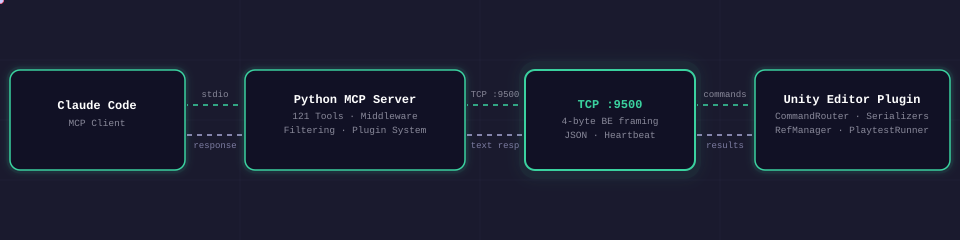

# Unity Biome MCP

<div align="center">



**Control the Unity Editor from MCP-compatible AI clients or from chat inside Unity.**

Inspect scenes, edit GameObjects, run playtests, and capture results through structured tools.

<br>

<p align="center"><a href="https://german-krasnikov.github.io/unity-biome-mcp/"></a>  </p>

<p align="center">   </p>

<p align="center"><a href="https://app.codecov.io/gh/german-krasnikov/unity-biome-mcp?flags%5B0%5D=python"></a> <a href="https://app.codecov.io/gh/german-krasnikov/unity-biome-mcp?flags%5B0%5D=csharp"></a> <a href="https://sonarcloud.io/summary/overall?id=german-krasnikov_unity-biome-mcp"></a> <a href="docs/quality/REPORT.md"></a></p>

<p align="center">  <a href="https://glama.ai/mcp/servers/german-krasnikov/unity-biome-mcp"></a></p>

</div>

<p align="center">
  <a href="#quick-start">Quick Start</a> ·
  <a href="https://german-krasnikov.github.io/unity-biome-mcp/">Documentation</a> ·
  <a href="docs/comparison.md">Comparison</a> ·
  <a href="CHANGELOG.md">Changelog</a>
</p>

## Quick Start

Requirements: Unity 6 (`6000.0` or newer), Git 2.14+ on `PATH`, and
[uv](https://docs.astral.sh/uv/). The MCP server does not need a separate Python
installation when it runs through `uvx`; optional Codex skill synchronization
requires Python 3.14 or newer on `PATH`. See the full
[Getting Started prerequisites](docs/getting-started/index.md#prerequisites).

### 1. Install uv

macOS and Linux:

```bash
curl -LsSf https://astral.sh/uv/install.sh | sh
```

Windows:

```powershell
winget install astral-sh.uv
```

### 2. Add the Unity package

1. In Unity, open **Window > Package Manager**.
2. Select **+ > Add package from git URL**.
3. Enter:

```text
https://github.com/german-krasnikov/unity-biome-mcp.git?path=unity-plugin
```

### 3. Configure your client

Open **MCP > Setup Wizard**, choose a client, and follow the result shown by the Wizard.

Configuration depends on the client. The Wizard may write a project configuration, run the configuration helper, copy a client-specific snippet, or defer configuration until In-Unity Chat starts. Restart the selected client when prompted. The Wizard configures the integration; it does not perform an end-to-end connection test.

<details>
<summary>Manual client setup guides</summary>

Use the matching guide:

[Claude Code](docs/install/claude-code.md) |
[Claude Desktop](docs/install/claude-desktop.md) |
[Codex](docs/install/codex.md) |
[Cursor](docs/install/cursor.md) |
[Junie](docs/install/junie.md) |
[Kimi](docs/install/kimi.md) |
[OpenCode](docs/install/opencode.md) |
[Rider AI Assistant](docs/install/rider.md) |
[VS Code](docs/install/vscode.md) |
[Windsurf](docs/install/windsurf.md)

For external OpenCode setup, do not use the Wizard's standard clipboard JSON:
OpenCode has a different configuration shape. Follow the
[OpenCode guide](docs/install/opencode.md#external-mcp-client).

</details>

### 4. Verify the first connection

For an external MCP client, keep the Unity project open, restart the client if
the Wizard asked you to, and send:

> Read the active Unity scene hierarchy at depth 2 and summarize its root objects.

The client should call:

```python
get_hierarchy(depth=2)
```

A successful response contains the active scene hierarchy. If the call fails, open **MCP > Status > Diagnose** in Unity. For Chat-only verification, use the
[Chat quick check](docs/getting-started/index.md#3-verify-the-first-connection). For command-line diagnostics, run:

```bash
uvx --from git+https://github.com/german-krasnikov/unity-biome-mcp.git#subdirectory=server unity-biome-mcp doctor
```

See [Getting Started](docs/getting-started/index.md) for recovery steps and platform details.

<details>
<summary>Local development installation</summary>

Requirements for a source checkout: Git and Python 3.14 or newer.

> **Upgrading from older Python:** Install Python 3.14 via `brew install python@3.14` (macOS), your system package manager (Linux), or [python.org](https://www.python.org/downloads/) (Windows). Then run `python install.py update` to recreate the virtual environment.

```bash
git clone https://github.com/german-krasnikov/unity-biome-mcp.git
cd unity-biome-mcp
python install.py setup
python install.py configure --tool claude-code
python install.py doctor
```

The configuration helper supports `claude-code`, `claude-desktop`, `cursor`,
`windsurf`, `vscode`, `codex`, `kimi`, `junie`, and `opencode`.

</details>

## Documentation

| Goal | Guide |
|---|---|
| Install and connect | [Getting Started](docs/getting-started/index.md) |
| Choose and configure an MCP client | [Client guides](docs/install/index.md) |
| Install project-local AI guidance | [AI Skills and Agents](docs/install/ai-skills.md) |
| Find a tool for a task | [Tool Guide](docs/features/tool-guide.md) |
| Use batch safely | [Batch Operations](docs/tools/batch.md) |
| Build Play Mode workflows | [PlayTest DSL](docs/features/playtest.md) |
| Configure In-Unity Chat | [Chat Backends](docs/chat/backends.md) |
| Extend Unity Biome MCP | [Plugin Quick Start](docs/plugins/index.md) |
| Diagnose failures | [Diagnostics](docs/tools/diagnostics.md) |

## What You Can Do

- **Scene and object editing:** inspect and modify GameObjects, components,
  assets, materials, shaders, and UI.
- **Playtesting and verification:** run PlayTest DSL workflows, compile checks,
  console checks, runtime diagnostics, and visual comparisons.
- **Animation and VFX:** work with clips, Animator controllers, Timeline,
  particles, materials, shaders, and Shader Graph.
- **Efficient tool use:** group compatible operations with `batch`, request
  deferred schemas, and enable capability categories only when needed.
- **Extensibility:** add project-specific server tools, Unity commands, Chat
  context chips, and plugin hooks.

<details>
<summary>Prompt and batch examples</summary>

Example prompts:

> Create a player object, add a Rigidbody, and place it at the scene origin.

> Find enemies without colliders and add a BoxCollider to each.

> Run a playtest that moves the player to the door and verifies that the score increases.

> Capture the Game View and compare it with the saved baseline.

> Summarize scene changes since the last checkpoint.

### Batch example

Use `batch` for two or more compatible operations:

```python
batch(commands="""
create_object name=Enemy
set_property path=Enemy component=Transform prop=position value=0,1,0
manage_component path=Enemy type=Rigidbody action=add
set_property path=Enemy component=Rigidbody prop=mass value=2
""")
```

Some typed tools are direct-only and cannot be placed in a batch. See the [Batch guide](docs/tools/batch.md) for validation, Undo-backed rollback, and error handling.

</details>

## Ways to Work

### External MCP client

An MCP client launches the Python server over stdio. The server discovers the active Unity project and sends framed commands to the editor plugin over localhost TCP.

### In-Unity Chat

Open **MCP > Chat** to work inside the editor. Select a supported CLI backend and use Ask or Agent mode. Authentication is handled by the selected CLI. Context chips can attach scene objects, scripts, and assets to a turn, while each completed AI turn is grouped for Unity undo.

See [Chat backends](docs/chat/backends.md) for setup and behavior.

## Architecture



The external path is `MCP client -> Python MCP server -> localhost TCP -> Unity Editor plugin`. In-Unity Chat invokes the selected CLI through the local chat relay; that CLI connects to the same Python MCP server and rejoins the shared TCP-to-plugin path.

## AI Skills

The Unity package includes 12 reusable domain skills and 4 focused agents for
Claude Code and Codex. They cover efficient MCP tool selection, batching,
Unity authoring, playtesting, diagnostics, and evidence-based verification.

Open **MCP > Install AI Skills** to install them into the current project.
Existing and generated files are ownership-checked before replacement. See
[AI Skills and Agents](docs/install/ai-skills.md) for paths, safe updates, and
Codex synchronization.

## Project Inventory

The values below are generated from registrations, pytest collection, Unity test discovery or source scanning, and package metadata. They are discovery counts, not a claim that every test was executed in the current checkout.

<!-- README_STATS_START -->

<!-- README_STATS_END -->

## Unity MCP Product Comparison

Verified August 16, 2026:

- **Unity Biome MCP:** 160 registered tools, deterministic PlayTest DSL, and visual baseline/diff workflows.
- **Unity MCP Server 2.17:** first-party local bridge, connection approval, and multi-client support.
- **MCP for Unity 10.1.2:** Unity 2021.3 compatibility, 47 tool entrypoints, and authenticated remote hosting.
- **AI Game Developer 0.87.0:** compiled-player runtime plus local, HTTP, cloud, and Docker deployment.
- **MCP Unity:** 33 listed tools, optional Undo rollback for batches, and an MCP App dashboard.

The detailed matrix cites exact source commits or versioned official documentation
and records constraints as well as strengths.

[Open the full source-backed comparison](docs/comparison.md)

## Recent Changes

<!-- CHANGELOG_START -->
**Current release: v1.50.3 (2026-08-23).** [Read the full changelog.](CHANGELOG.md)
<!-- CHANGELOG_END -->

## Contributing

Read [CONTRIBUTING.md](CONTRIBUTING.md) before opening a pull request. New contributors can start with [good first issues](https://github.com/german-krasnikov/unity-biome-mcp/issues?q=is%3Aissue+is%3Aopen+label%3A%22good+first+issue%22).

Report security issues through [SECURITY.md](SECURITY.md).

## License

[MIT](LICENSE)
