# Unity MCP Product Comparison

This July 29, 2026 snapshot compares publicly documented Unity MCP products.
It does not assign an overall winner: projects optimize for different Unity
versions, deployment models, safety controls, and workflows.

Method and terminology

- The official Unity MCP Server is checked against the linked Assistant 2.16
  documentation.
- Open-source projects are checked at the exact linked commits.
- **Documented** means the linked source or documentation describes the capability.
- **Limited** means the documented scope is narrower than the capability definition.
- **Not documented** means no comparable capability was found in that public
  snapshot. It does not prove that the capability is impossible.
- Tool-entrypoint counts are inventory, not a quality or coverage score. Projects
  group actions differently.

## Product Guide

### Unity Biome MCP

- **Best fit:** deterministic [PlayTest DSL and suites](features/playtest.md),
  [pixel baselines with optional semantic comparison](tools/screenshots.md#screenshot_compare),
  and a broad local Unity tool surface.
- **Snapshot:** [Unity 6000.0](https://github.com/german-krasnikov/unity-biome-mcp/blob/master/unity-plugin/package.json);
  [generated tool inventory](assets/_meta.json); Python 3.10+ through `uv`;
  [MIT](https://github.com/german-krasnikov/unity-biome-mcp/blob/master/LICENSE).
- **Relevant constraint:** Unity 6 and a Python/`uv` server. Semantic comparison
  requires a configured Claude CLI and LLM budget. Remote transport and MCP in a
  compiled player are not documented.

### Unity MCP Server / Assistant 2.16.0-pre.1

- **Best fit:** first-party [local relay and IPC bridge](https://docs.unity3d.com/Packages/com.unity.ai.assistant@2.16/manual/integration/unity-mcp-overview.html#how-unity-mcp-works)
  with [connection approval and multi-client controls](https://docs.unity3d.com/Packages/com.unity.ai.assistant@2.16/manual/integration/unity-mcp-overview.html#connection-security).
- **Snapshot:** [Unity 6000.0](https://docs.unity3d.com/Packages/com.unity.ai.assistant@2.16/manual/integration/unity-mcp-get-started.html#prerequisites);
  tool count is not publicly listed; the AI Assistant package uses an installed
  local relay.
- **Relevant constraint:** public source, license, and tool count were not
  identified in the cited official documentation. Access is through a
  [Unity subscription or trial](https://unity.com/blog/unity-ai-how-to-get-started).

### MCP for Unity v10 / `fc70dda`

- **Best fit:** the broadest declared compatibility floor at
  [Unity 2021.3 LTS](https://github.com/CoplayDev/unity-mcp/blob/fc70dda75da27f97e9a012e77b6de86af40c044c/README.md#quickstart),
  plus opt-in [2D/3D asset generation and import](https://github.com/CoplayDev/unity-mcp/blob/fc70dda75da27f97e9a012e77b6de86af40c044c/docs/wiki/V10.md#L56-L83).
- **Snapshot:** [47 published tools](https://github.com/CoplayDev/unity-mcp/blob/fc70dda75da27f97e9a012e77b6de86af40c044c/README.md#what-it-does);
  Python 3.10+ through `uv`; [MIT](https://github.com/CoplayDev/unity-mcp/blob/fc70dda75da27f97e9a012e77b6de86af40c044c/LICENSE).
- **Relevant constraint:** generation uses third-party providers and
  user-supplied keys. Batch execution is sequential and has no documented
  rollback.

### AI Game Developer / `f6db1c2`

- **Best fit:** [MCP in a compiled game](https://github.com/IvanMurzak/Unity-MCP/blob/f6db1c27e7f0d647dd3a127e2fff3a65c5785cc5/README.md#runtime-usage-in-game)
  and [local, HTTP, cloud, and Docker deployment](https://github.com/IvanMurzak/Unity-MCP/blob/f6db1c27e7f0d647dd3a127e2fff3a65c5785cc5/README.md#docker-).
- **Snapshot:** [Unity 2022.3](https://github.com/IvanMurzak/Unity-MCP/blob/f6db1c27e7f0d647dd3a127e2fff3a65c5785cc5/Unity-MCP-Plugin/Packages/com.ivanmurzak.unity.mcp/package.json#L19);
  [70+ published tools](https://github.com/IvanMurzak/Unity-MCP/blob/f6db1c27e7f0d647dd3a127e2fff3a65c5785cc5/README.md#skills-and-tools-reference);
  prebuilt server and npm setup CLI; [Apache-2.0](https://github.com/IvanMurzak/Unity-MCP/blob/f6db1c27e7f0d647dd3a127e2fff3a65c5785cc5/LICENSE).
- **Relevant constraint:** no general cross-tool batch or Undo rollback is
  documented.

### MCP Unity / `bbfb1c0`

- **Best fit:** [optional Unity Undo rollback for batch operations](https://github.com/CoderGamester/mcp-unity/blob/bbfb1c0681519ced5b357ce7cc3c1ee68c9dc64e/Editor/Tools/BatchExecuteTool.cs#L43-L88)
  and an [interactive MCP App dashboard and resources](https://github.com/CoderGamester/mcp-unity/blob/bbfb1c0681519ced5b357ce7cc3c1ee68c9dc64e/README.md#L148-L192).
- **Snapshot:** README declares Unity 6 while the
  [manifest declares 2022.3](https://github.com/CoderGamester/mcp-unity/blob/bbfb1c0681519ced5b357ce7cc3c1ee68c9dc64e/package.json#L6);
  [34 tools registered in source](https://github.com/CoderGamester/mcp-unity/blob/bbfb1c0681519ced5b357ce7cc3c1ee68c9dc64e/Server~/src/index.ts#L68-L102);
  Node.js 18+; [MIT](https://github.com/CoderGamester/mcp-unity/blob/bbfb1c0681519ced5b357ce7cc3c1ee68c9dc64e/LICENSE.md).
- **Relevant constraint:** Undo rollback covers recorded Unity changes, not
  every external side effect. The dashboard requires VS Code 1.109+.

## Capability Evidence

The two-column layout remains readable on narrow GitHub views. Products listed
as not documented had no comparable capability in the cited snapshot.

### Setup and operation

| Capability | Documented support |
|---|---|
| Assisted client setup | **Biome:** [Setup Wizard](https://github.com/german-krasnikov/unity-biome-mcp/blob/master/README.md#3-configure-your-client) **Unity MCP Server:** [automatic integration setup](https://docs.unity3d.com/Packages/com.unity.ai.assistant@2.16/manual/integration/unity-mcp-get-started.html#auto-configuration) **MCP for Unity:** [configure detected clients](https://github.com/CoplayDev/unity-mcp/blob/fc70dda75da27f97e9a012e77b6de86af40c044c/README.md#quickstart) **AI Game Developer:** [Editor configuration and CLI](https://github.com/IvanMurzak/Unity-MCP/blob/f6db1c27e7f0d647dd3a127e2fff3a65c5785cc5/README.md#step-3-configure-ai-agent) **MCP Unity:** [Editor configuration buttons](https://github.com/CoderGamester/mcp-unity/blob/bbfb1c0681519ced5b357ce7cc3c1ee68c9dc64e/README.md#step-3-configure-ai-llm-client) |
| General cross-tool batch | **Biome:** [`batch`](tools/batch.md) **MCP for Unity:** sequential [`batch_execute`](https://github.com/CoplayDev/unity-mcp/blob/fc70dda75da27f97e9a012e77b6de86af40c044c/MCPForUnity/Editor/Tools/BatchExecute.cs#L13-L60) **AI Game Developer:** [limited multi-target tools](https://github.com/IvanMurzak/Unity-MCP/blob/f6db1c27e7f0d647dd3a127e2fff3a65c5785cc5/Unity-MCP-Plugin/Packages/com.ivanmurzak.unity.mcp/Editor/Scripts/API/Tool/GameObject.Duplicate.cs#L29-L46), no general orchestrator documented **MCP Unity:** [`batch_execute`](https://github.com/CoderGamester/mcp-unity/blob/bbfb1c0681519ced5b357ce7cc3c1ee68c9dc64e/Server~/src/tools/batchExecuteTool.ts#L8-L134) **Not documented:** Unity MCP Server; its [batch-mode setting](https://docs.unity3d.com/Packages/com.unity.ai.assistant@2.16/manual/reference/unity-mcp-reference.html#general-settings) controls approval, not operation batching |
| Undo rollback for a general batch | **Biome:** [optional Unity Undo rollback](tools/batch.md#batch) **MCP Unity:** [optional Unity Undo rollback](https://github.com/CoderGamester/mcp-unity/blob/bbfb1c0681519ced5b357ce7cc3c1ee68c9dc64e/Editor/Tools/BatchExecuteTool.cs#L43-L88) **Not documented:** Unity MCP Server, MCP for Unity, AI Game Developer |
| Multiple loaded scenes | **Biome:** [add, close, activate, and transfer](tools/scene.md#scene) **Unity MCP Server:** [limited scene management](https://docs.unity3d.com/Packages/com.unity.ai.assistant@2.16/manual/integration/unity-mcp-overview.html#tools-in-unity-mcp); multi-loaded-scene operations are not specified **MCP for Unity:** [`manage_scene` additive workflow](https://github.com/CoplayDev/unity-mcp/blob/fc70dda75da27f97e9a012e77b6de86af40c044c/MCPForUnity/Editor/Tools/ManageScene.cs#L1600-L1613) **AI Game Developer:** [list, open, activate, and unload](https://github.com/IvanMurzak/Unity-MCP/blob/f6db1c27e7f0d647dd3a127e2fff3a65c5785cc5/README.md#L126-L154) **MCP Unity:** [`load_scene` additive loading](https://github.com/CoderGamester/mcp-unity/blob/bbfb1c0681519ced5b357ce7cc3c1ee68c9dc64e/README.md#L89-L112) |
| Multiple projects or Unity instances | **Biome:** [project-aware port discovery](https://github.com/german-krasnikov/unity-biome-mcp/blob/master/server/src/unity_mcp/server_filtering.py) **Unity MCP Server:** [target by project path or Editor PID](https://docs.unity3d.com/Packages/com.unity.ai.assistant@2.16/manual/integration/unity-mcp-get-started.html#target-a-specific-unity-instance) **MCP for Unity:** [explicit multi-instance routing](https://github.com/CoplayDev/unity-mcp/blob/fc70dda75da27f97e9a012e77b6de86af40c044c/README.md#advanced) **AI Game Developer:** [deterministic per-project ports](https://github.com/IvanMurzak/Unity-MCP/blob/f6db1c27e7f0d647dd3a127e2fff3a65c5785cc5/cli/README.md#L641) **Not documented:** MCP Unity |
| Multiple clients on one Unity instance | **Biome:** [up to eight clients per port](https://github.com/german-krasnikov/unity-biome-mcp/blob/master/unity-plugin/Editor/ClientSlot.cs) **Unity MCP Server:** [explicit multi-client support](https://docs.unity3d.com/Packages/com.unity.ai.assistant@2.16/manual/integration/unity-mcp-overview.html#key-features) **Not documented:** MCP for Unity, AI Game Developer, MCP Unity |
| Tool visibility controls | **Biome:** [capability categories](settings.md#tools-and-permissions) **Unity MCP Server:** [per-tool enable/disable](https://docs.unity3d.com/Packages/com.unity.ai.assistant@2.16/manual/integration/unity-mcp-overview.html#project-settings) **MCP for Unity:** [`manage_tools` groups](https://github.com/CoplayDev/unity-mcp/blob/fc70dda75da27f97e9a012e77b6de86af40c044c/Server/src/services/tools/manage_tools.py) **AI Game Developer:** [per-tool enable state](https://github.com/IvanMurzak/Unity-MCP/blob/f6db1c27e7f0d647dd3a127e2fff3a65c5785cc5/Unity-MCP-Plugin/Packages/com.ivanmurzak.unity.mcp/Editor/Scripts/API/Tool/Tool.SetEnabledState.cs#L25-L47) **Not documented:** MCP Unity |

### Verification and development

| Capability | Documented support |
|---|---|
| Unity Test Runner | **Biome:** [EditMode and PlayMode tools](tools/scene.md#run_tests) **MCP for Unity:** [`run_tests`](https://github.com/CoplayDev/unity-mcp/blob/fc70dda75da27f97e9a012e77b6de86af40c044c/Server/src/services/tools/run_tests.py#L154-L250) **AI Game Developer:** [`tests-run`](https://github.com/IvanMurzak/Unity-MCP/blob/f6db1c27e7f0d647dd3a127e2fff3a65c5785cc5/README.md#L156-L174) **MCP Unity:** [`run_tests`](https://github.com/CoderGamester/mcp-unity/blob/bbfb1c0681519ced5b357ce7cc3c1ee68c9dc64e/README.md#L74-L78) **Not documented:** Unity MCP Server |
| Deterministic scenario DSL | **Biome:** [PlayTest DSL and suites](features/playtest.md) **Not documented:** Unity MCP Server, MCP for Unity, AI Game Developer, MCP Unity |
| Screenshot capture | **Biome:** [Game, Scene, and multi-view](tools/screenshots.md) **MCP for Unity:** [Game, Scene, and multi-view](https://github.com/CoplayDev/unity-mcp/blob/fc70dda75da27f97e9a012e77b6de86af40c044c/MCPForUnity/Editor/Tools/ManageScene.cs#L517-L1270) **AI Game Developer:** [Camera, Game, Scene, and isolated](https://github.com/IvanMurzak/Unity-MCP/blob/f6db1c27e7f0d647dd3a127e2fff3a65c5785cc5/README.md#L126-L154) **Not documented:** Unity MCP Server, MCP Unity |
| Visual baseline and diff | **Biome:** [pixel comparison with optional semantic comparison](tools/screenshots.md#screenshot_compare) through a configured Claude CLI and LLM budget **Not documented:** Unity MCP Server, MCP for Unity, AI Game Developer, MCP Unity |
| Roslyn validation or execution | **Biome:** [code execution and analysis](features/code-execution.md) **Unity MCP Server:** [limited script validation levels](https://docs.unity3d.com/Packages/com.unity.ai.assistant@2.16/manual/reference/unity-mcp-reference.html#general-settings); implementation and arbitrary execution are not documented **MCP for Unity:** [optional script validation](https://github.com/CoplayDev/unity-mcp/blob/fc70dda75da27f97e9a012e77b6de86af40c044c/README.md#advanced) **AI Game Developer:** [`script-execute`](https://github.com/IvanMurzak/Unity-MCP/blob/f6db1c27e7f0d647dd3a127e2fff3a65c5785cc5/README.md#L156-L174) **Not documented:** MCP Unity |
| Custom project tools | **Biome:** [plugin API and entry points](plugins/index.md) **Unity MCP Server:** [attributes, interfaces, and runtime registration](https://docs.unity3d.com/Packages/com.unity.ai.assistant@2.16/manual/integration/unity-mcp-tool-registration.html) **MCP for Unity:** [dynamic custom-tool service](https://github.com/CoplayDev/unity-mcp/blob/fc70dda75da27f97e9a012e77b6de86af40c044c/Server/src/services/custom_tool_service.py#L330-L419) **AI Game Developer:** [attribute-based custom tools](https://github.com/IvanMurzak/Unity-MCP/blob/f6db1c27e7f0d647dd3a127e2fff3a65c5785cc5/README.md#add-custom-tool) **MCP Unity:** [manual C# and TypeScript extension](https://github.com/CoderGamester/mcp-unity/blob/bbfb1c0681519ced5b357ce7cc3c1ee68c9dc64e/README.md#L576-L588) |

### Interaction and deployment

| Capability | Documented support |
|---|---|
| Direct-client connection approval | **Unity MCP Server:** [first connection requires approval](https://docs.unity3d.com/Packages/com.unity.ai.assistant@2.16/manual/integration/unity-mcp-get-started.html#step-3-approve-the-connection) **MCP for Unity:** [remote-token authentication](https://github.com/CoplayDev/unity-mcp/blob/fc70dda75da27f97e9a012e77b6de86af40c044c/Server/README.md#remote-hosted-mode); local approval is not documented **Not documented:** Biome, AI Game Developer, MCP Unity |
| Chat window inside Unity | **Biome:** [bundled multi-backend Chat](chat/index.md) **Unity MCP Server:** [separate Unity AI Assistant in the same package](https://unity.com/blog/unity-ai-how-to-get-started) **Not documented:** MCP for Unity, AI Game Developer, MCP Unity |
| MCP inside a compiled player | **AI Game Developer:** [documented runtime support](https://github.com/IvanMurzak/Unity-MCP/blob/f6db1c27e7f0d647dd3a127e2fff3a65c5785cc5/README.md#runtime-usage-in-game) **Not documented:** Biome, Unity MCP Server, MCP for Unity, MCP Unity |
| Remote MCP transport | **Unity MCP Server:** [local stdio relay and IPC bridge](https://docs.unity3d.com/Packages/com.unity.ai.assistant@2.16/manual/integration/unity-mcp-overview.html#how-unity-mcp-works); remote transport is not documented **MCP for Unity:** [authenticated HTTP transport](https://github.com/CoplayDev/unity-mcp/blob/fc70dda75da27f97e9a012e77b6de86af40c044c/Server/README.md#remote-hosted-mode) **AI Game Developer:** [HTTP and Docker deployment](https://github.com/IvanMurzak/Unity-MCP/blob/f6db1c27e7f0d647dd3a127e2fff3a65c5785cc5/docs/DOCKER_DEPLOYMENT.md) **Not documented:** Biome, MCP Unity |

## Maintenance

This page is intentionally dated because competitor capabilities change quickly.
When updating it:

1. Re-check every external project at one explicit commit or package version.
2. Prefer source code and official product documentation over announcements.
3. Replace stale claims instead of adding historical notes to the matrix.
4. Keep unknowns as **not documented** and avoid inferred negatives.
5. Verify the published desktop and narrow/mobile GitHub layouts.

[Back to README](https://github.com/german-krasnikov/unity-biome-mcp/blob/master/README.md)
