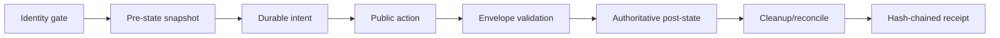
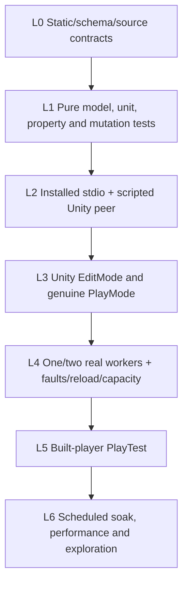
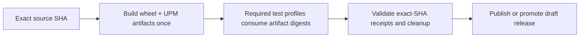

# Unity Biome MCP Testing Architecture V2

Status: normative design draft  
Inputs: v1.26 source audit, two-project live audit, existing durable UTF/reload
infrastructure, and current Win/macOS/Linux workflows.

## Purpose

Testing Architecture V2 proves the MCP as a composed product. It does not
replace unit tests or Unity EditMode tests. It adds the missing contract layer
that follows an operation from the released public boundary to an authoritative
effect and back to a verified clean state.

The governing principle is:

> A PASS is a machine-verifiable state transition, not a successful process,
> plausible response, screenshot, log line, or agent opinion.

## The contract kernel

Every scenario has the same canonical shape:



The kernel evaluates six independent questions:

1. **Identity** — did the action reach the intended project, process, scene,
   plugin, protocol, and source artifact?
2. **Delivery** — was the intent unsent, sent without ACK, acknowledged, or
   replayed?
3. **Envelope** — do transport status, JSON-RPC error, `isError`, semantic code,
   text, and capability status agree?
4. **Effect** — did all required state change, and did every protected domain
   remain unchanged?
5. **Lifecycle** — did Play, compile, reload, scene, and connection move through
   a newer valid epoch rather than reuse stale readiness?
6. **Cleanup** — are scene state, assets, processes, sockets, locks, callbacks,
   monitors, `Time.timeScale`, and test-owned files restored or explicitly
   reported dirty?

Unknown evidence produces `BLOCKED` or `UNTESTED`, never `PASS`.

## Layered proof



| Layer | Boundary | Required role |
|---|---|---|
| L0 | source, generated schema, registration catalog | completeness and drift |
| L1 | pure Python/C# | causal behavior, state machine, shrinking, cleanup logic |
| L2 | installed MCP stdio to scripted framed TCP peer | public protocol on every OS without Unity |
| L3 | Unity Test Framework | actual Editor callbacks, frames, physics, Animator, scene lifecycle |
| L4 | disposable Unity workers | full product composition, routing, reload, faults and resources |
| L5 | immutable built player | runtime PlayTest semantics outside the Editor |
| L6 | long-running workers | bounded soak, perf baseline, stateful exploration |

Real Unity is deliberately scarce. It verifies high-risk compositions and does
not repeat parser permutations already proved below it.

## One operator surface, modular internals

The system exposes one CLI/profile selector but keeps small, testable modules:

```text
scripts/conformance_runner.py             thin compatibility CLI
scripts/gauntlet/
  model.py                                typed contracts and reference state
  receipts.py                             append-only JSONL journal
  runner.py                               transition kernel
  release_evidence.py                     fail-closed release attestation
  catalog.py                              independent contract manifest loader
  generator.py                            legal deterministic case generation
  replay_minimizer.py                     fresh-worker replay and shrinking
  orchestrator.py                         profiles and transition ownership
  drivers/
    public_stdio.py                       installed MCP JSON-RPC boundary
    fake_unity.py                         scripted framed-TCP Unity peer
    unity_worker.py                       real worker adapter
    cli.py                                installed CLI process boundary
    chat_relay.py                         framed relay boundary
  oracles/
    envelope.py
    identity.py
    unity_state.py
    filesystem.py
    process.py
    lifecycle.py
  workers/
    factory.py
    lease.py
    supervisor.py
  faults/
    proxy.py
    plan.py
```

“One runner” means one invocation, profile vocabulary, receipt schema, and
operator experience. It must not become one monolithic implementation.

## Two authorities, not one self-confirming schema

Product metadata and the expected test oracle must be related but independent:

1. `ToolSpec` describes what the product advertises.
2. A frozen, reviewed contract manifest describes what tests require.

The Gauntlet compares them. Generating both sides from the same map would allow
one wrong mutability or action classification to make product and test agree.

Each public tool/action/mode is classified by:

- input schema and conditional parameters;
- effect domains;
- Edit/Play/compile/capability preconditions;
- retry and idempotency semantics;
- expected envelope and error codes;
- authoritative pre/post oracles;
- cleanup obligations;
- direct, batch, intent, and alias surfaces;
- supported platforms and capability variants.

“Every public tool” has an explicit scope. The core contract manifest covers
all built-in tools shipped in the staged package. A dynamically loaded plugin
must ship a versioned extension manifest for its public tools and contribute
that manifest digest to run identity. An enabled plugin without a valid
extension manifest makes catalog completeness `BLOCKED`; it is never silently
classified as a core read or omitted. Profiles declare whether they require no
plugins, an exact plugin set, or a reviewed extension capability.

### Effect domains

Binary read/write is insufficient. V2 uses a set of domains:

```text
PURE_READ
OBSERVER_STATE
RUNTIME_STATE
UNITY_PERSISTENT
FILESYSTEM
PROCESS_CONTROL
LIFECYCLE
EXTERNAL_SERVICE
```

Parameter-dependent selectors are explicit. For example, `dry_run=true` may be
required to preserve `UNITY_PERSISTENT`, while `find_type` chooses a different
handler branch. An unclassified combination fails catalog completeness.

## Reference state model

Per worker, the model tracks:

```text
Identity
  worker UUID, canonical project, port, Unity PID/version,
  package/plugin/protocol/server identities, active scene

Epoch vector
  connection, scene, compile request, compile start,
  domain reload, Play transition, console mark

Lifecycle
  EditIdle -> EnteringPlay -> PlayReady -> Stopping -> EditIdle
  EditIdle -> CompilePending -> Compiling -> Reloading -> EditIdle

Persistence
  loaded scenes, active scene, dirty flags, protected hashes,
  owned objects/assets, settings and build outputs

Delivery
  INTENT_WRITTEN -> UNSENT | SENT_NO_ACK | ACKED
  SENT_NO_ACK -> APPLIED_UNKNOWN until reconciled

Capacity
  listener identity, protocol-validated sessions, pending handshakes,
  admission headroom, process/socket/FD/lock baselines
```

Generation operates only on legal transitions. Invalid-input tests use a
separate negative model so random noise cannot dominate useful coverage.

An `APPLIED_UNKNOWN` transition is never blindly retried. Automatic retry is
allowed only when the reviewed contract proves the operation is side-effect
free, idempotent with a durable full-envelope receipt, or externally
reconcilable to a unique committed state. Other unknown mutations stop for
reconciliation; “exactly once” is not a generic transport promise.

## Durable receipts

Every scenario writes intent before dispatch and appends events to a
hash-chained JSONL journal. A minimum event contains:

```json
{
  "schema_version": 1,
  "run_id": "uuid",
  "seq": 7,
  "event_type": "action_observed",
  "timestamp": "RFC3339",
  "prev_hash": "sha256",
  "payload": {},
  "event_hash": "sha256"
}
```

Required event classes:

```text
run_started
worker_leased
identity_verified
scenario_started
intent_recorded
request_transmitted
action_observed
post_state_observed
cleanup_observed
scenario_finished
run_finished
```

The journal is append-only, resumable only for the same run identity, and
verified for sequence, hash, schema, and terminal completeness. Binary/log/test
artifacts are content-addressed from the receipt instead of embedded.

### Artifact privacy

Public Gauntlet receipts are safe metadata, not raw transcripts. They store argument names,
canonical digests, byte counts, verdicts and stable error codes. They never
store raw tool arguments, prompts, generated text, source snippets, environment
variables, credentials, user-home paths or full Unity responses. Diagnostic
content belongs in an explicitly owned temporary artifact bundle with retention
and upload policy; a public CI artifact is scanned before publication. A digest
supports identity and replay correlation without copying private content into
logs or commit history.

The product's operation replay store is a separate boundary. Exactly-once
replay may require the complete semantic response, so the SUT stores that
envelope atomically in project-local, untracked, owner-only storage with a
bounded TTL and operation ID. It is never emitted to console, JSONL, CI
artifacts, or source history; it is removed after the acknowledgement/retention
window and verified during cleanup. A public receipt records only its digest
and lifecycle state. Digest-only evidence is not treated as replay content.

Release evidence is a separate immutable summary that requires:

- exact source SHA, frozen harness-lock digest, artifact-manifest digest, and
  typed digests for the Python wheel and Unity UPM package;
- release-policy version and digest;
- exact profile, OS, Python, Unity and plugin-manifest identities;
- expected canonical scenario/leaf manifest and its digest;
- executed canonical scenario/leaf IDs and an exact set equality proof;
- selected/executed/passed/failed/skipped/blocked/untested counts;
- required worker count plus distinct independently verified worker
  identity/lease receipts, not a caller-claimed “started” count;
- protected-state and independent cleanup receipt hashes;
- journal and artifact hashes;
- creation time and expiry.

No selected tests, an unexpected skip, stale SHA, missing worker, dirty cleanup,
`BLOCKED`/`UNTESTED`, expected-versus-executed scenario drift, or a missing
artifact is a hard release failure. A pytest exit code cannot synthesize worker,
artifact, or cleanup evidence.

## Drivers and oracles

### Installed public stdio

The real wheel/entry point is launched as the SUT. A standard MCP client performs
initialize, tool discovery, and tool calls. This layer sees JSON schema,
argument rejection, middleware, guards, reconnect, distillation, and product
version exactly as users do.

### Scripted Unity peer

A hermetic framed-TCP peer provides deterministic responses and faults on all
three OSes. It supports:

- delayed or missing responses;
- malformed length/header/body and abrupt EOF;
- wrong project/version/epoch identity;
- typed `BUSY` admission;
- duplicate request/response;
- lost ACK before and after a modeled commit;
- compile/Play/reload epoch scripts.

It cannot close a real-Unity contract; it cheaply proves the Python/public half
before expensive Unity runs.

### Real worker

Workers are disposable clones created from one immutable package artifact. Each
has a unique sentinel, writable audit scene, protected scene, leased port, and
test-only epoch evidence. Both A and B are symmetric; read-only is a server
policy under test.

### Independent oracles

Oracles read state through a path different from the action where practical:

- typed Unity readback after a mutation;
- save, close, exact reopen, and repeated readback for persistence;
- disk/SCM hash for protected assets;
- PID/process-group/socket/lock inventory for cleanup;
- compile/domain/Play epoch probe for lifecycle;
- public envelope consistency checks;
- exact test XML/JSON result rather than console prose.

Screenshots prove layout only. AI prose proves nothing.

## Lifecycle ownership

Each scenario declares exactly one lifecycle owner.

### Compile

```text
reserve compile generation N
-> mutate/import source
-> observe compile start for N, or authoritative no-op
-> observe reload/new domain
-> observe ready for N
-> fetch uncached diagnostics for N
```

An idle observation recorded before the source mutation cannot satisfy this
contract.

### PlayTest

```text
verified EditIdle
-> one owner requests Play
-> observe a new PlayReady epoch
-> dispatch one test or suite
-> stop in a single idempotent finally
-> observe EditIdle and clean resource baseline
```

The outer orchestrator must not restart the Editor while a runner also uses
`fresh`/`restart_between`. Failure, timeout, cancellation, compile, reload, and
transport loss end as `FAILED_CLEAN` or `FAILED_DIRTY`, never a plausible PASS.

### Scene

```text
intent
-> public mutation
-> typed readback
-> save
-> close target
-> reopen exact target alone
-> typed readback + disk hash
```

Final acceptance unloads additive reference/staging scenes to prevent hidden
cross-scene references and duplicate schedulers from producing a false green.

## Fault and concurrency model

Faults are named, deterministic, and recorded at protocol boundaries:

- before request transmission;
- after full request, before dispatch;
- after each child commit;
- after response persistence, before ACK;
- mid-header or mid-body;
- delayed ACK beyond client timeout;
- duplicate request/response;
- reconnect during compile/reload/Play;
- newcomer at capacity.

The proxy records upstream/downstream byte hashes and delivery stage, allowing
the runner to distinguish `UNSENT` from `APPLIED_UNKNOWN`.

Connection tests remain separate:

- **churn**: exactly one fresh public process at a time, 900/900, baseline after
  every attempt;
- **admission**: explicit 7 -> 8 -> 9, ninth receives `BUSY`, original eight stay
  responsive;
- **concurrent startup**: bounded parallel initialize against A and B with no
  eviction, EOF, crash-log growth, or resource leak.

## Deterministic generation and exploration

Primary generation uses a reviewed state model, fixed seed, boundary-biased
values, pairwise modes, commuting operations, inverse operations, and
metamorphic relations. A failure is replayed on a fresh worker and reduced while
preserving the same invariant failure.

Hypothesis is appropriate for pure/model and hermetic stdio layers because it
records and shrinks sequences. Real Unity generation uses the same serialized
cases with bounded steps and fresh-worker replay.

The current monkey suites should be reclassified as parser fuzz, relay stress,
or model-based exploration. Blind random calls are not release evidence. A
random or AI-found failure gates release only after deterministic replay,
minimization, and promotion to the regression corpus.

## CLI, chat, and AI

Provider executables are tested through deterministic shims on every OS. A shim
receives only an allowlisted synthetic environment, records redacted argv plus
stdin/environment digests and byte counts, emits scripted stdout/stderr, supports
delay/crash/oversized output, and proves descendant cleanup. Raw provider input
or output is never persisted. Paid-provider checks are small scheduled canaries
and never assert or archive generated prose.

AI may:

- propose high-risk transition sequences from catalog changes;
- cluster receipt failures;
- prioritize uncovered state/edge combinations;
- draft a candidate fixture for review.

AI may not:

- decide PASS/FAIL;
- invent an expected post-state;
- retry an ambiguous mutation;
- approve cleanup;
- modify the release evidence after execution.

## Built-player PlayTest

The PlayTest language is split into portable core, runtime host, and Editor
adapter:

```text
unity-plugin/Runtime/Playtest/Core/
  UnityMCP.Playtest.Core.asmdef
  parser, AST/IR, comparisons, variables and receipt model

unity-plugin/Runtime/Playtest/Player/
  UnityMCP.Playtest.Player.asmdef
  player-loop host, runtime world adapter, JSON/JUnit sink

unity-plugin/Editor/Playtest/
  UnityMCP.Playtest.Editor.asmdef
  AssetDatabase/config loader and Editor lifecycle adapter
```

Interfaces isolate the runtime:

```csharp
IPlaytestClock
IWorldQuery
IPlaytestActionExecutor
IPlaytestLifecycle
IReceiptSink
```

CI builds an immutable minimal demo player, launches it with a scenario manifest
and deterministic seed, waits with a hard timeout, requires atomic JSON/JUnit,
and treats missing output or nonzero exit as failure. Differential contracts
compare file versus inline, single versus suite, explicit reload versus fresh,
Editor interpreter versus player interpreter, and Win/Linux/macOS outcomes.

Test assemblies and assets are excluded from production/Luna builds through
`autoReferenced=false`, a dedicated test define, and a build-report zero-footprint
gate. The MCP server itself is not embedded in players.

## CI profiles

| Profile | Boundary | Platform | Trigger |
|---|---|---|---|
| `static` | source/schema/catalog | all | every PR |
| `unit` | Python/C# pure | all | every PR |
| `public-stdio` | installed MCP + fake peer | all | every PR |
| `unity-editmode` | UTF EditMode | all | every PR |
| `unity-playmode-smoke` | real PlayMode | Linux PR; all nightly | affected PR/nightly |
| `unity-single` | one disposable worker | Linux | affected PR/nightly |
| `unity-dual` | A/B routing and isolation | exclusive runner | nightly/release |
| `fault-reload-capacity` | real faults/epochs/admission | exclusive runner | release |
| `player-playtest` | built player | all | nightly/release |
| `soak` | model exploration/perf/leaks | selected | scheduled/manual |

Required lanes fail when zero tests are selected or a worker cannot start. A
capability-specific test may report `BLOCKED`, but a release profile requiring
that capability cannot be green.

A versioned machine-readable release policy activates the normative gates. It
  contains `policy_version`, activation package version, artifact types, exact
profile × OS × Python/Unity matrix, plugin scope, canonical scenario-manifest
  digest, expected worker roles/count/identity constraints, maximum age, and
  allowed outcomes. Actual identities come from independently verified receipts. Leaf
  IDs are unique and canonicalized for independent/parallel scenarios; only
  declared state-machine edges and lifecycle events impose order. This
removes ambiguity while later lanes are still being implemented: inactive
future gates remain visible roadmap debt, and an active gate cannot disappear
through a workflow selector.

Authoritative lanes install dependencies from a frozen harness lock and record
its digest. A separate non-gating compatibility lane tests the advertised
dependency ranges; release evidence never depends on freshly resolved floating
versions.

## Release gates

### Enforcement topology

Release publication is the terminal node of one fail-closed DAG. A release
workflow must:



`Publish` has explicit `needs` dependencies on build, required profile receipts,
and evidence validation. Independent tag-triggered “release” and “preflight”
workflows are not a gate because their ordering and success are unrelated. If
platform or Unity infrastructure requires separate reusable workflows, the
parent release workflow waits for and verifies their artifacts. An alternative
is to create a draft with no public assets and promote it only after the same
evidence validation; a failed or unavailable profile leaves the draft
unpublished.

Every profile tests the exact typed artifact digests built by this DAG. A
canonical artifact-manifest digest binds the wheel, UPM archive and any plugin
extensions. Rebuilding per job or testing source checkouts while publishing
different bytes is forbidden.

| Gate | Required proof |
|---|---|
| G0 Artifact identity | exact commit, wheel/UPM/plugin/protocol and Unity tuple |
| G1 Catalog completeness | every built-in and enabled-plugin action/mode classified |
| G2 Envelope truth | transport, JSON-RPC, `isError`, code, text and state agree |
| G3 Non-interference | read/dry-run/RO preserve protected domains |
| G4 Delivery/retry | reconciled effect and full-envelope replay where contract permits retry |
| G5 Lifecycle | newer Play/compile/reload/scene epochs and final cleanup |
| G6 Isolation | A/B/BA/AB/ABA preserve identity and independent state |
| G7 Connection | 900 churn plus separate admission/startup scenarios |
| G8 CLI/chat/AI | deterministic process/transcript and cleanup contracts |
| G9 Platform | required receipts for Linux/macOS/Windows |
| G10 Player/Luna | runtime assertions, portrait+landscape, <=5 MB and zero test footprint |

## Architecture decisions

1. Extend the existing durable test infrastructure; do not build a parallel
   unrelated framework.
2. Test the installed public process, not only direct internal calls.
3. Keep the expected contract manifest independently reviewed from product
   metadata.
4. Prefer deterministic model transitions over blind monkey calls.
5. Record intent before dispatch and reconcile unknown outcomes.
6. Treat cleanup as part of correctness.
7. Separate sequential churn from concurrent admission.
8. Give each lifecycle transition exactly one owner.
9. Use AI for discovery and triage only.
10. Implement incrementally behind passing gates; no big-bang rewrite.
