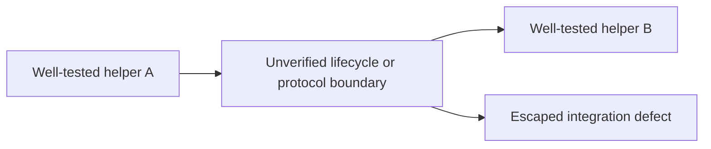

# Unity Biome MCP v1.26 testing audit

Status: source-audited on 2026-08-09  
Source: `v1.26.0` / `695bfbb1e04514f6bb6bfcd5a5f0a013d8eb38f4`  
Scope: Python server, installed CLI boundary, chat and AI adapters, Unity C#,
live Unity, CI, release evidence, and future built-player PlayTest execution.

This document records observed facts. The target design is specified in
[Testing Architecture V2](architecture-v2.md), and the staged implementation
is tracked in [Implementation Roadmap](implementation-roadmap.md).

## Executive verdict

The repository has unusually broad unit and EditMode coverage, but test count
currently overstates release confidence. The dominant escaped-defect pattern is
not an untested helper. It is a composition boundary that no single test owns:



Examples include public stdio to Unity TCP, request commit to lost ACK, Play
entry to suite dispatch, compile request to a newer reload epoch, reconnect to
project identity, and runner failure to cleanup. The next test architecture
must make those boundaries first-class contracts.

## Reproducible inventory

### Python

| Scope | Physical test files | Collected nodes |
|---|---:|---:|
| `server/tests` | 334, of which 333 collect | 5,650 |
| top-level server tests | 302 | 5,306 |
| `server/tests/live` | 19 | 287 |
| `server/tests/conformance` | 8 | 40 |
| `server/tests/cross_project` | 5 | 17 |
| `install/tests` | 3 | 76 |
| `scripts/tests` | 21 | 407 |

Marker selection in the server suite:

| Selection | Nodes |
|---|---:|
| `not live and not monkey` | 4,807 |
| `not live and not monkey and not slow` | 4,768 |
| `live` | 332 |
| `live_cli` | 9 |
| `live_chat` | 205 |
| `conformance` | 31 |
| `cross_project` | 14 |
| `monkey` | 511 |
| `slow` | 39 |
| `perf` | **0** |

The 511 monkey cases are mostly fixed mock matrices rather than product-level
exploration: 200 relay stress cases, 200 focus cases, 100 ask-mode cases, and
11 smaller relay cases. They are useful deterministic component stress, but
they are not evidence for real Unity connection, reload, capacity, or cleanup.

`server/tests/test_property_based.py` is currently skipped wholesale because
Hypothesis is imported through `pytest.importorskip` but is absent from the dev
dependency lock. Several of those properties also test standard-library JSON
or `struct` round trips rather than the product framing implementation.

### Unity C#

The source contains 516 package/reload test files plus 49 Editor tests in the
Unity fixture project. Static source counts find 7,041 `[Test]` and 383
`[TestCase*]` annotations across those locations. These are authoring counts,
not a receipt of discovered or executed cases.

All current test assemblies are Editor-only. There is no genuine PlayMode test
assembly, no actual `[UnityTest]`, and no checked-in `.playtest` corpus in the
fixture projects. The authoring guard deliberately rejects `[UnityTest]` and
`IEnumerator`, which is appropriate for EditMode but currently prevents a
separate frame-driven runtime lane.

Existing strengths include:

- ownership-tagged scene, object, asset, EditorPrefs and global-state cleanup;
- durable UTF request/run reconciliation under `Library/UnityMCP/TestRuns`;
- exact expected-leaf manifests and append-only journals;
- source/build/assembly fingerprints across reload;
- explicit worker-only fault-injection fixtures.

These facilities should be reused, not replaced.

### CI and release evidence

Current CI has three-platform Unity EditMode coverage. Python runs on Ubuntu
3.11/3.12 and macOS/Windows 3.12, although the package advertises Python 3.10+.
Nightly is Linux-only for Python and Unity EditMode.

The current cross-layer trigger graph is incomplete:

- Python CI does not trigger on Unity plugin changes.
- Unity CI does not trigger on server/protocol changes.
- conformance PR triggers omit Unity plugin paths.

The release-tag evidence exposed a concrete false-green. For release commit
`695bfbb1`, GitHub Actions run `31267117878` reported `CI Conformance=success`,
while both real single-project and dual-project conformance jobs were skipped;
only the unit job ran. Release preflight accepted workflow success without
requiring exact executed profiles or exact-SHA evidence.

Publication and preflight are also independent tag-triggered workflows. There
is no `needs`, reusable-workflow result, protected environment, or promotion
edge that prevents `release.yml` from publishing before conformance/preflight
finishes. At the audited release, publication completed before the nominal
gate. This is a topology defect, not merely a missing assertion.

## Boundary coverage

```text
Pure Python/C# unit calls                  strong
Mock/local framed TCP                     moderate
Real Python subprocess relay              useful but narrow
Direct Python -> Unity TCP                 partial live coverage
Installed MCP stdio -> Unity TCP           missing
Persistent session across scene/reload     missing/partial
Two-project public reconnect A -> B -> A   missing
Real PlayMode PlayTest suite               missing
Built-player PlayTest                      missing
```

Current conformance talks directly to `UnityBridge`. It bypasses the installed
MCP process, stdio initialization, public JSON-RPC schema validation, wrappers,
middleware, response distillation, and reconnect state as one product path.
No test was found using `mcp.client.stdio`, `ClientSession`, or an equivalent
installed-process handshake.

## High-confidence gaps

### Connection admission and startup

`ClientSlot` currently replaces an established connection when all eight slots
are occupied, and an existing test protects that replacement behavior. A TCP
socket occupies a slot before a valid first frame, so startup probes can consume
capacity. Missing acceptance:

- eight protocol-validated clients remain responsive;
- a ninth receives a typed `BUSY` response;
- half-open and no-frame sockets expire without evicting clients;
- concurrent MCP startup probes do not crash initialize or grow resources.

The isolated sequential 900-session churn test passed 900/900 on v1.26 and is
valuable leak evidence. It does not cover concurrent admission or ninth-client
overflow; those are separate contracts.

### Lifecycle and reload

Batch-mode acceptance does not run the production registration graph.
`MCPServer` skips normal static callback registration in batch mode, while the
reload harness manually starts a subset. Same-port rebind, interactive compile
callbacks, scene cache invalidation, and production event ordering therefore
remain partially unproved.

Compile waiting can accept an old idle observation before a delayed compile
starts. A correct fence must reserve and observe a newer compile/domain epoch.

### Operations and lost ACK

Deduplication records `op_id` after response construction. A partial
non-atomic batch can commit a child, return early on a later error, lose the ACK,
and replay the committed child. Unit tests cover the registry map, not the
CommandRouter + transport + post-state seam.

Required evidence is a journaled operation lifecycle:

`accepted -> dispatched -> child committed -> response persisted -> ACK`

and a retry that returns the same full semantic envelope without applying a
committed child twice.

### PlayTest lifecycle

The PlayTest runner is an Editor update-loop closure. Its ordinary terminal path
resets monitors and `Time.timeScale`; the exception path can unsubscribe and
return an error without running the same final cleanup. Fresh scene entry can
also continue after a fixed timeout instead of failing closed.

No current live test runs `run_playtest_suite` end-to-end. Failure, timeout,
cancellation, transport loss, compile/reload, and Editor stop must each prove a
stopped, clean terminal state.

### Public contract truth

The v1.26 audit reproduced mismatches between metadata, public envelopes, and
effects. Retained regression classes include:

- error text returned with `isError=false`;
- schema declaring `additionalProperties=false` while runtime accepts extras;
- parameter-dependent mutation misclassified as read or dry-run;
- Python-local writers bypassing Unity read-only guards;
- tool discovery mutability differing from runtime effects;
- tools suggesting `full=true` without exposing or honoring it;
- conditional Unity capabilities advertised as always available;
- reconnect identity contradictions;
- nested Animator state lookup failure;
- delayed compile false-green;
- partial-batch lost-ACK replay;
- PlayTest failure cleanup and state leakage.

## Existing assets to preserve

The redesign should compose these proven pieces:

- `run_unity_tests.py`: durable UTF reconciliation;
- `scripts/run_unity_domain_reload_acceptance.py`: reload-generation proof;
- `scripts/run_unity_fault_injection.py`: worker-only cleanup faults;
- `scripts/create_unity_test_worker.py`: initial worker bootstrapping;
- `server/tests/live/unity_state_owner.py`: Python-side ownership diffing;
- `UnityMcpTestBase`: C# isolation and cleanup facade.

The large scripts should share transport, identity, lease, receipt, and process
supervision modules instead of continuing to duplicate them.

## Test-environment preflight

Two disposable endpoints were verified without mutation:

| Role | Project | Port | Scene | Policy | State |
|---|---|---:|---|---|---|
| worker A | `unity-test-project` | 9600 | `GridTest` | writable | clean/stopped/idle |
| worker B | `unity-test-project-ro` | 9699 | `SampleScene` | read-only | clean/stopped/idle |

Both reported plugin `1.26.0` and protocol `3`. For the final symmetric
two-worker architecture, both fixtures should be disposable and writable;
read-only must be a process policy under test rather than an intrinsic worker
role.

## Root pattern

The common shape behind the escaped problems is:

1. helper A is unit-tested;
2. helper B is unit-tested;
3. their composition owns no durable intent, epoch, or cleanup contract;
4. a stale observation, partial effect, transport loss, or callback exception
   creates a believable but false success;
5. CI counts the isolated green tests and misses the broken product path.

Every critical fix therefore requires two proofs:

1. a small causal RED test at the defect seam;
2. a public-boundary acceptance scenario with authoritative pre/post state,
   cleanup evidence, and a durable receipt.
